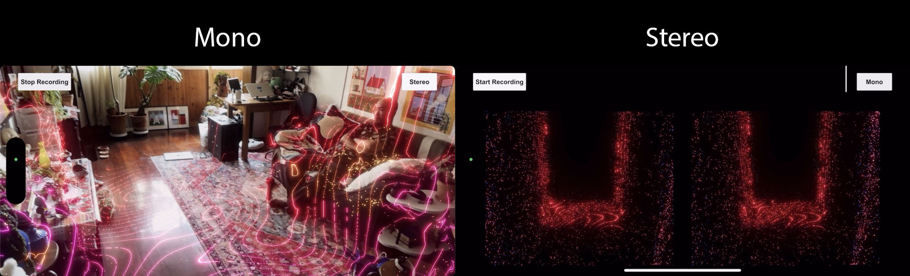

## What is EchoVision

EchoVision is an AR mobile application where users' voices are visually represented in the surrounding environment, simulating the echolocation system of bats. This allows users to experience what it feels like to be a bat.  
EchoVision also serves as a sample project for [HoloKit](https://holokit.io/), an Open-Source Mixed Reality Headset created by Holo Interactive.

## Requirement
***It requires the iPhone model with a Lidar camera***, since EchoVision utilizes the Meshing and Human Segmentation features from Apple ARKit.

## How to play
You can download the app from app store by searching "EchoVision". 
- Mono Mode 
  In this mode, users can interactive with EchoVision without HoloKit.
- Stereo Mode 
  In this mode, user can get a more immersive AR experience with HoloKit.
<div">

## How to run
- Unity Version: 6000.0
- Change build target to iOS in `Project Setting/Player settings`
- Enable "Requires ARKit Support" in `Project Setting/Player settings`
- Enable "Apple ARKit" in `Project Setting/XR Plug-in Management`

## Known issues
- Microphone might not work properly when recording due to the occupancy by the audio analyzor and the recorder at the same time. 

